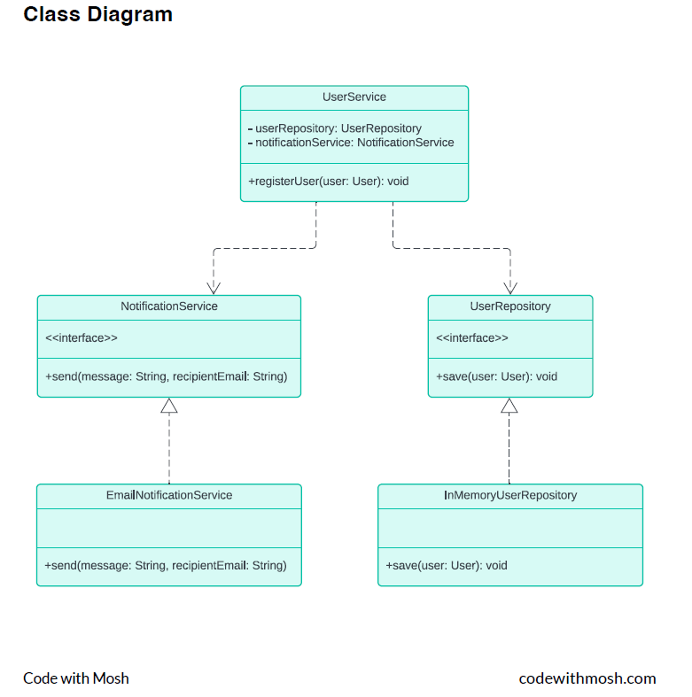

# Exercise: Implementing a User Registration Service
In this exercise, you will design and implement a User Registration Service that allows
users to register by providing their name, email, and password. The system will save the
user in a repository and simulate sending a notification to the user after registration. The
mail server settings (such as host and port) for sending notifications should be
configurable via the application.properties file. This is a simulation, and no actual emails
will be sent.

# Steps
# 1. Define the User class:
• Attributes:
• id (Long)
• email (String)
• password (String)
• name (String)
# 2. Implement the UserRepository interface:
• Define the UserRepository interface with a single method
• save(User user): void
• Implement the UserRepository interface in a class called
InMemoryUserRepository. Use a HashMap to store users in memory, with the
email address as the key and the User object as the value.
# 3. Implement the NotificationService interface:
• Define a NotificationService with a method:
• send(String message, String recipientEmail): void
• Create an EmailNotificationService that implements this interface and
simulates sending an email by printing to the console.
• The mail server settings (such as host and port) should be read from the
application.properties file and printed as part of the simulated email sending
process.
# 4. Design the UserService class:
• The UserService should:
• Register a new user using the UserRepository.
• Send a confirmation notification using the NotificationService.
• Ensure that UserService can work with any implementation of
NotificationService, making the notification method easily replaceable.

# 5. Test the registration system:
• In your main method, create an instance of UserService and call the
registerUser() method.
• Verify that the user is saved and a confirmation message is printed to the
console simulating an email notification.
# 6. Bonus step: Handle duplicate user registration.
Code
